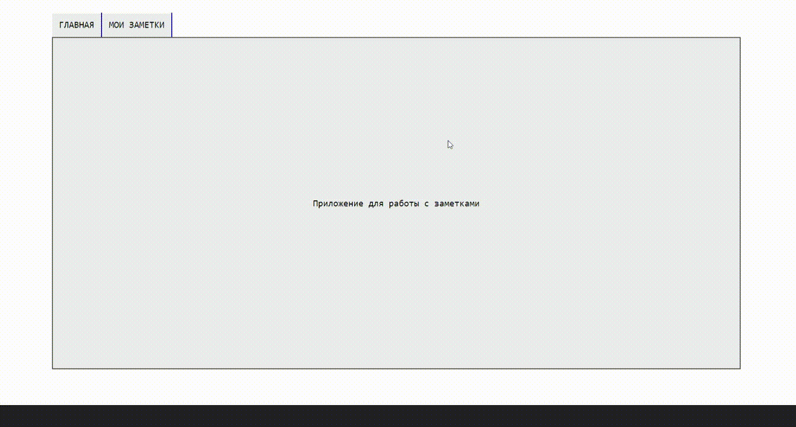

# Next.js Note App
<div>
  
  
  
  
</div>



A web application for working with notes.
- Adding a new note.
- Editing a note.
- Deleting a note.
- Exporting a note to a txt file.
- Importing a note from a txt file.

This is a [Next.js](https://nextjs.org/) project bootstrapped with [`create-next-app`](https://github.com/vercel/next.js/tree/canary/packages/create-next-app).

## Directory Structure

`├──`[`src`](./src) — Web application front-end built with Next.js.<br>
`├──`[`public`](./public) — Public folder.<br>
`├──`[`pb_data`](./pb_data) — Stores your application data, uploaded files, etc.<br>
`├──`[`pb_migrations`](./pb_migrations) — Contains JS migration files with your collection changes.<br>

## Getting Started

First, run  ```./pocketbase serve``` in the extracted directory

Second, run the development server:

```bash
npm run dev
# or
yarn dev
# or
pnpm dev
```

Open [http://localhost:3000](http://localhost:3000) with your browser to see the result.
